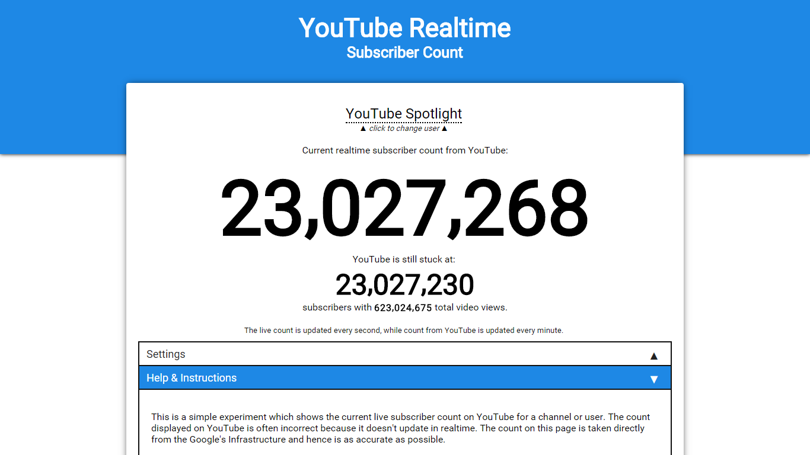
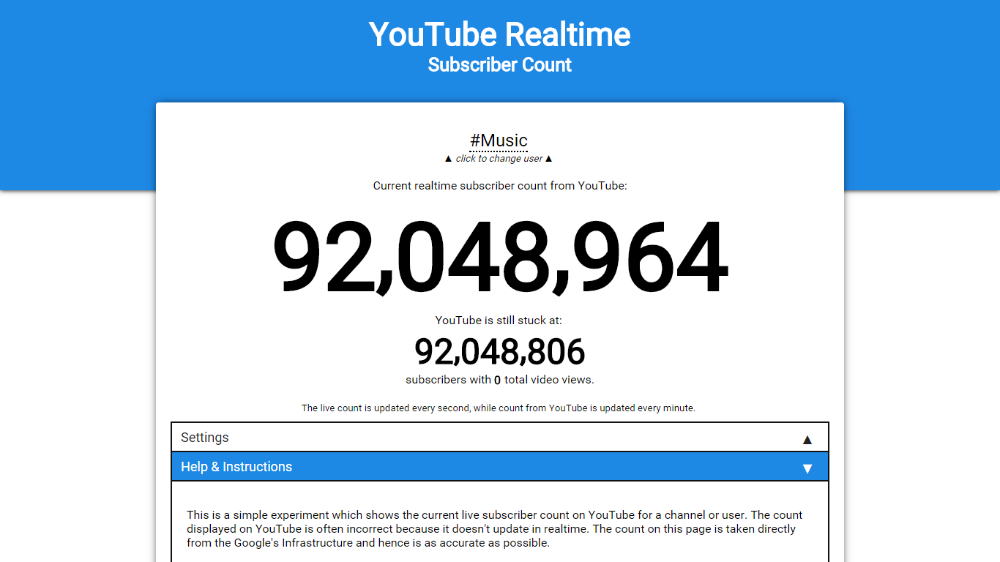
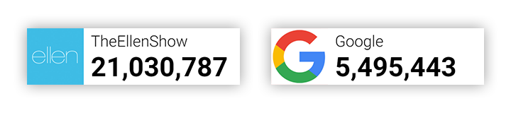

# YouTube Realtime

This is a simple experiment which shows the current live subscriber count on YouTube for a user. The count displayed on YouTube is often incorrect because it doesn't update in real time. The count used on this experiment is taken directly from the API and hence is guaranteed to be accurate.

The design follows Material Guidelines by Google, although could be slightly displaced for better experience. This page is super light and the follow up network requests are as minimal as possible.

You can directly bookmark the relevant page to directly jump to a specific user. Sharing features are built right into the web app.

 
*YouTube Realtime showing YouTube Spotlight*

Feel free to submit issues/pull request if you'd like to contribute.

I've been seeing a lot of copies of this project on the internet, please consider adding an attribution link if you are planning to deploy this project on your website. If you are a YouTuber, consider using a direct link for your channel instead of creating a new clone website. Thanks!

 
*YouTube Realtime showing Justin Bieber*

# Features

* Realtime Subscriber Count
* Pin your favourite YouTubers for easy access
* Aesthetically pleasing design and colors
* Easy channel selection
* Displays the video count of the user
* Shows total video views of the user
* Shows total comment count of the user
* Easy Sharing built in
* Embeds
* Immersive UI
* Simple custom URLs

# Embeds

Embedding the counter on your website is a cool way to display the real time count of your channel on your own website. The feature is built right into it, and is available on the website itself. You just need to copy the embed code and paste it as HTML code on your own website.

 
*YouTube Realtime Embed*

# Try it yourself!

* [Sky Does Minecraft](https://akshatmittal.com/youtube-realtime/#!/SkyDoesMinecraft "Sky Does Minecraft's Realtime Subscriber Count on YouTube")
* [Justin Bieber](https://akshatmittal.com/youtube-realtime/#!/UCHkj014U2CQ2Nv0UZeYpE_A "Justin Bieber's Realtime Subscriber Count on YouTube")
* [Smosh](https://akshatmittal.com/youtube-realtime/#!/Smosh "Smosh's Realtime Subscriber Count on YouTube")
* [Marques Brownlee](https://akshatmittal.com/youtube-realtime/#!/MarquesBrownlee "Marques Brownlee's Realtime Subscriber Count on YouTube")
* [YouTube Spotlight](https://akshatmittal.com/youtube-realtime/#!/UCBR8-60-B28hp2BmDPdntcQ "YouTube Spotlight's Realtime Subscriber Count on YouTube")

# License

YouTube Realtime Copyright (C) 2018 [Akshat Mittal](https://akshatmittal.com/)

You are allowed to use, modify and redistribute the project as long as original credits are kept and changes are documented. You are not allowed to redistribute the project without attribution and credits or prior permission.

This project uses a part of code from WrapPixel.

Please see LICENSE.md file in the same directory.

# Disclaimer

The project forks and code by default redirects back to this repo. You can view the instructions to modify the code [here](https://github.com/akshatmittal/youtube-realtime/issues/14#issuecomment-247537299).
