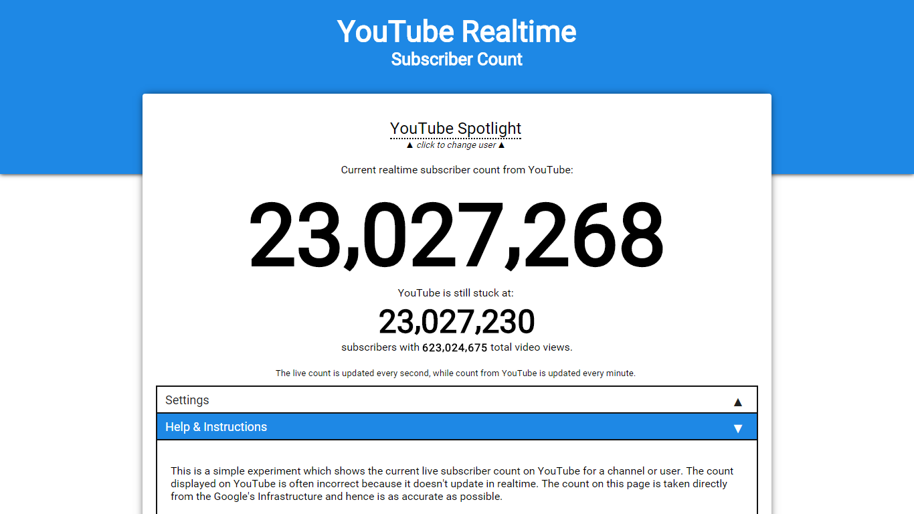
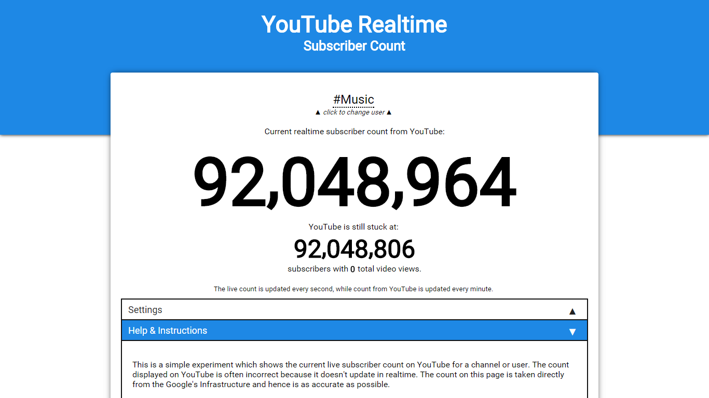

# Roblox Realtime

This is a simple experiment which shows the current live member count on Roblox for a group. The count displayed on Roblox is often not updated in real time. The count used on this experiment is taken directly from the official Roblox APIs and hence is guaranteed to be accurate.

This page is super light and the follow up network requests are as minimal as possible.

You can directly bookmark the relevant page to directly jump to a specific group. Sharing features are built right into the web app.

## API Integration

This application now uses the **official Roblox Open Cloud API** instead of third-party services:
- Group information: `https://apis.roblox.com/cloud/v2/groups/{groupId}`
- Group search: `https://apis.roblox.com/cloud/v2/groups/search`
- Group icons: `https://thumbnails.roblox.com/v1/groups/icons`

All API calls are made directly to Roblox's official endpoints, ensuring data accuracy and reliability.

### API Key Configuration

For requests to the Roblox Open Cloud API (`apis.roblox.com/cloud`), you can configure an API key to authenticate your requests:

**Method 1: Set via JavaScript**
```javascript
YT.robloxApi.setApiKey('your-api-key-here');
```

**Method 2: Set as global variable**
```javascript
window.ROBLOX_API_KEY = 'your-api-key-here';
```

**Method 3: Use localStorage (persists across sessions)**
```javascript
localStorage.setItem('roblox_api_key', 'your-api-key-here');
```

The API key will automatically be sent as the `x-api-key` header for all Open Cloud API requests.

<br/>
_Roblox Realtime showing a popular group_

Feel free to submit issues/pull request if you'd like to contribute.

I've been seeing a lot of copies of this project on the internet, please consider adding an attribution link if you are planning to deploy this project on your website. If you are a group owner, consider using a direct link for your group instead of creating a new clone website. Thanks!

<br/>
_Roblox Realtime showing another group_

# Features

- Realtime Member Count
- Easily compare member counts for any two groups
- Aesthetically pleasing design and colors
- Easy group selection
- Shows total group visits (when available)
- Shows total games count (when available)
- Easy Sharing built in
- Embeds
- Immersive UI
- Simple custom URLs

# Embeds

Embedding the counter on your website is a cool way to display the real time count of your group on your own website. The feature is built right into it, and is available on the website itself. You just need to copy the embed code and paste it as HTML code on your own website. ([Info here.](https://counts.live/embeds))

<br/>
<br/>
_Roblox Realtime Embed_

# Try it yourself!

- [Roblox](https://akshatmittal.com/youtube-realtime/#!/1200769 "Roblox's Realtime Member Count")
- [Adopt Me!](https://akshatmittal.com/youtube-realtime/#!/733 "Adopt Me!'s Realtime Member Count")
- [Brookhaven](https://akshatmittal.com/youtube-realtime/#!/4199740 "Brookhaven's Realtime Member Count")
- [Phantom Forces](https://akshatmittal.com/youtube-realtime/#!/634617 "Phantom Forces's Realtime Member Count")
- [Arsenal](https://akshatmittal.com/youtube-realtime/#!/2998087 "Arsenal's Realtime Member Count")

# License

Roblox Realtime Copyright (C) 2020 [Akshat Mittal](https://akshatmittal.com/)

You may freely modify the code for personal use. You are not allowed to redistribute the project without attribution and credits or prior permission. Commercial use without permission is prohibited.

This project uses a part of code from WrapPixel.

# Disclaimer

The project forks and code by default redirects back to this repo. You can view the instructions to modify the code [here](https://github.com/akshatmittal/youtube-realtime/issues/14#issuecomment-247537299).

# Support

This project is supported by [Metacrypt](https://www.metacrypt.org/) and [Create My Token](https://www.createmytoken.com/). They provide services such as the [free ERC20 token generator](https://www.createmytoken.com/token-generator/ethereum-erc20-generator/), [free BEP20 token generator](https://www.createmytoken.com/token-generator/bnb-smart-chain-bep20-generator/) and [free Solana SPL Token Creator](https://www.createmytoken.com/solana-token-creator/spl-token/).
